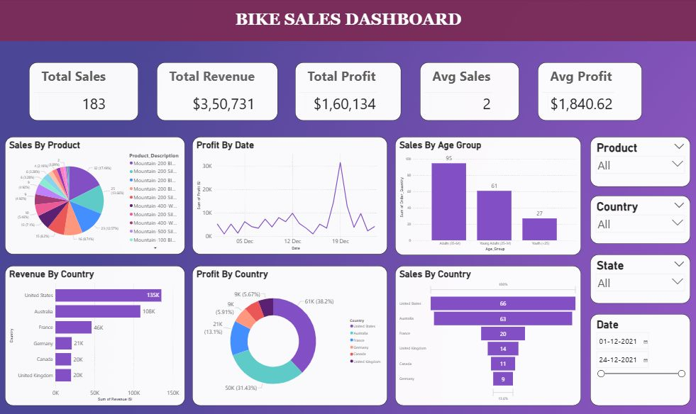

### Bike Sales Analysis
Power BI Dashboard for Bike Sales Data that I cleaned using MySQL

📊 Dashboard Features :-
 
✨ KPI's are displayed at the top

✨ 6 visualizations for showing trends in Bike Sales

✨ 4 slicers for filtering

☘️ Steps Followed :-

✨ Cleaned Data in MySQL

✨ Performed Data Modeling in Power BI, creating a star schema of on fact table and three dimension tables

✨ Wrote DAX Queries in Power BI for creating calculated measures

✨ Created Dashboard in Power BI

🔍 Key Insights :-

⭐ United States has made most revenue ($135K) through bike sales.

⭐ An average profit of $1840.62 has been generated.

⭐ Highest profit has been generated ($31,422) on 19 December, 2021.

⭐ Mostly adults (35 - 64 years of age) have purchased bikes.

🛠️ Tools Used :-

✨ Power BI for Data Modeling, DAX queries and Dashboard creation

✨ MySQL for Data Cleaning

💡 Skills Used :-

🚀 Data Modeling

🚀 Data Cleaning (MySQL)

🚀 DAX 

🚀 Dashboard Creation
